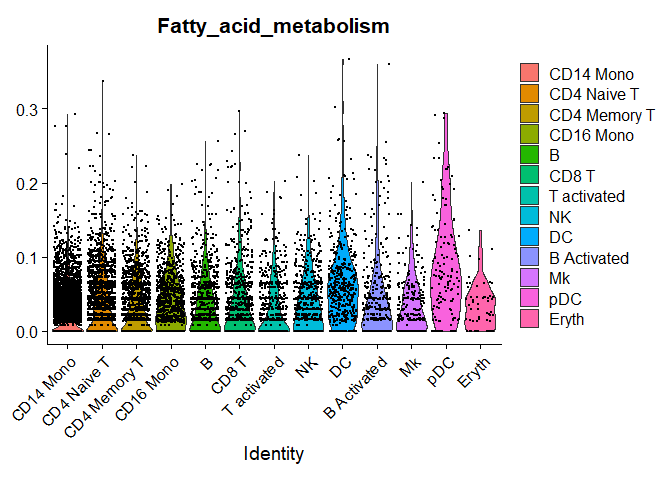
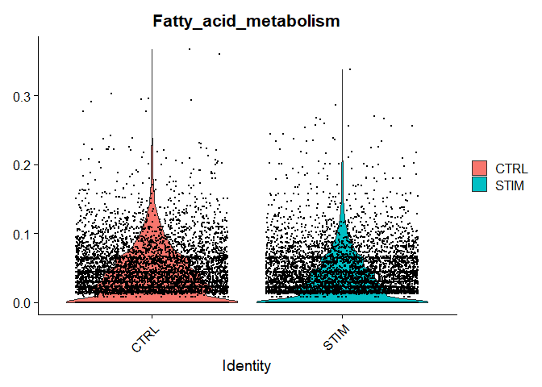

<!-- README.md is generated from README.Rmd. Please edit that file -->

# scScorer

<!-- badges: start -->
<!-- badges: end -->

scScorer builds a gene-interaction graph for each KEGG pathway, assigns
gene importance weights via a PageRank-style algorithm, and then
computes per-cell pathway activity scores by fitting a
(negative-binomial or zero-inflated NB) model to weighted gene
expression while adjusting for batch effects and library size.

## Principle

In scScorer, each KEGG pathway is represented as a directed
gene-interaction network, where nodes correspond to genes and edges
reflect regulatory or metabolic interactions. A PageRank-style algorithm
is applied on this network to assign an importance weight to every gene,
capturing its topological influence within the pathway. Genes that
occupy more central or highly connected positions receive higher
weights, reflecting their stronger contribution to the pathway’s overall
activity.

For each cell, the weighted expression of pathway genes is modeled using
either a Negative Binomial (NB) or Zero-Inflated NB (ZINB) regression
framework. This model accounts for dropout events and cell-specific
covariates such as sequencing depth or batch effects through offset and
batch terms. The fitted model estimates conditional mean functions (CMF)
that represent the probability of gene activation given cell-specific
factors. These CMF-based probabilities are then combined using the
PageRank-derived weights to produce a final pathway activity score for
each cell, quantifying the functional engagement of that pathway at the
single-cell level.

## Advantages

- Constructs a gene-interaction graph for each pathway and assigns gene
  importance weights via a PageRank-style algorithm  
- Integrates weighted gene expression into a per-cell scoring framework
  using NB or ZINB models  
- Adjusts for batch effects and library size via offsets, making the
  scores more robust across cells  
- Allows flexible selection of KEGG pathway sets (e.g., “Metabolism”,
  “Human Diseases”) for targeted analyses

## Installation

You can install the development version of scScorer from
[GitHub](https://github.com/Sean-Guo-Xu/scScorer) with:

``` r

if (!requireNamespace("BiocManager", quietly = TRUE))
    install.packages("BiocManager")
if (!requireNamespace("remotes", quietly = TRUE))
    install.packages("remotes")

BiocManager::install(c(
    "graphite",
    "KEGGREST",
    "clusterProfiler",
    "org.Hs.eg.db"
))

remotes::install_github("Sean-Guo-Xu/scScorer")
```

## Example

``` r

library(scScorer)
library(Seurat)
library(SeuratData)

## ----ifnb example-------------------------------------------------------------
# InstallData("ifnb")
data("ifnb")
res2 <- ProbScorer(
  ifnb@assays$RNA@counts,
  PathwaySet = "Metabolism"
)
#> [1] "Transformation Begins"
#> [1] "0.0957854406130268%"
#> [1] "0.191570881226054%"
#> [1] "0.28735632183908%"
#> [1] "0.383141762452107%"
#> [1] "0.478927203065134%"
#> [1] "0.574712643678161%"
#> [1] "0.670498084291188%"
#> [1] "0.766283524904214%"
#> [1] "0.862068965517241%"
#> [1] "0.957854406130268%"
#> [1] "1.0536398467433%"
#> [1] "1.14942528735632%"
#> [1] "1.24521072796935%"
#> [1] "1.34099616858238%"
#> [1] "1.4367816091954%"
#> [1] "1.53256704980843%"
#> [1] "1.62835249042146%"
#> [1] "1.72413793103448%"
#> [1] "1.81992337164751%"
#> [1] "1.91570881226054%"
#> [1] "2.01149425287356%"
#> [1] "2.10727969348659%"
#> [1] "2.20306513409962%"
#> [1] "2.29885057471264%"
#> [1] "2.39463601532567%"
#> [1] "2.4904214559387%"
#> [1] "2.58620689655172%"
#> [1] "2.68199233716475%"
#> [1] "2.77777777777778%"
#> [1] "2.8735632183908%"
#> [1] "2.96934865900383%"
#> [1] "3.06513409961686%"
#> [1] "3.16091954022989%"
#> [1] "3.25670498084291%"
#> [1] "3.35249042145594%"
#> [1] "3.44827586206897%"
#> [1] "3.54406130268199%"
#> [1] "3.63984674329502%"
#> [1] "3.73563218390805%"
#> [1] "3.83141762452107%"
#> [1] "3.9272030651341%"
#> [1] "4.02298850574713%"
#> [1] "4.11877394636015%"
#> [1] "4.21455938697318%"
#> [1] "4.31034482758621%"
#> [1] "4.40613026819923%"
#> [1] "4.50191570881226%"
#> [1] "4.59770114942529%"
#> [1] "4.69348659003831%"
#> [1] "4.78927203065134%"
#> [1] "4.88505747126437%"
#> [1] "4.98084291187739%"
#> [1] "5.07662835249042%"
#> [1] "5.17241379310345%"
#> [1] "5.26819923371647%"
#> [1] "5.3639846743295%"
#> [1] "5.45977011494253%"
#> [1] "5.55555555555556%"
#> [1] "5.65134099616858%"
#> [1] "5.74712643678161%"
#> [1] "5.84291187739464%"
#> [1] "5.93869731800766%"
#> [1] "6.03448275862069%"
#> [1] "6.13026819923372%"
#> [1] "6.22605363984674%"
#> [1] "6.32183908045977%"
#> [1] "6.4176245210728%"
#> [1] "6.51340996168582%"
#> [1] "6.60919540229885%"
#> [1] "6.70498084291188%"
#> [1] "6.8007662835249%"
#> [1] "6.89655172413793%"
#> [1] "6.99233716475096%"
#> [1] "7.08812260536398%"
#> [1] "7.18390804597701%"
#> [1] "7.27969348659004%"
#> [1] "7.37547892720306%"
#> [1] "7.47126436781609%"
#> [1] "7.56704980842912%"
#> [1] "7.66283524904215%"
#> [1] "7.75862068965517%"
#> [1] "7.8544061302682%"
#> [1] "7.95019157088123%"
#> [1] "8.04597701149425%"
#> [1] "8.14176245210728%"
#> [1] "8.23754789272031%"
#> [1] "8.33333333333333%"
#> [1] "8.42911877394636%"
#> [1] "8.52490421455939%"
#> [1] "8.62068965517241%"
#> [1] "8.71647509578544%"
#> [1] "8.81226053639847%"
#> [1] "8.9080459770115%"
#> [1] "9.00383141762452%"
#> [1] "9.09961685823755%"
#> [1] "9.19540229885057%"
#> [1] "9.2911877394636%"
#> [1] "9.38697318007663%"
#> [1] "9.48275862068965%"
#> [1] "9.57854406130268%"
#> [1] "9.67432950191571%"
#> [1] "9.77011494252874%"
#> [1] "9.86590038314176%"
#> [1] "9.96168582375479%"
#> [1] "10.0574712643678%"
#> [1] "10.1532567049808%"
#> [1] "10.2490421455939%"
#> [1] "10.3448275862069%"
#> [1] "10.4406130268199%"
#> [1] "10.5363984674329%"
#> [1] "10.632183908046%"
#> [1] "10.727969348659%"
#> [1] "10.823754789272%"
#> [1] "10.9195402298851%"
#> [1] "11.0153256704981%"
#> [1] "11.1111111111111%"
#> [1] "11.2068965517241%"
#> [1] "11.3026819923372%"
#> [1] "11.3984674329502%"
#> [1] "11.4942528735632%"
#> [1] "11.5900383141762%"
#> [1] "11.6858237547893%"
#> [1] "11.7816091954023%"
#> [1] "11.8773946360153%"
#> [1] "11.9731800766284%"
#> [1] "12.0689655172414%"
#> [1] "12.1647509578544%"
#> [1] "12.2605363984674%"
#> [1] "12.3563218390805%"
#> [1] "12.4521072796935%"
#> [1] "12.5478927203065%"
#> [1] "12.6436781609195%"
#> [1] "12.7394636015326%"
#> [1] "12.8352490421456%"
#> [1] "12.9310344827586%"
#> [1] "13.0268199233716%"
#> [1] "13.1226053639847%"
#> [1] "13.2183908045977%"
#> [1] "13.3141762452107%"
#> [1] "13.4099616858238%"
#> [1] "13.5057471264368%"
#> [1] "13.6015325670498%"
#> [1] "13.6973180076628%"
#> [1] "13.7931034482759%"
#> [1] "13.8888888888889%"
#> [1] "13.9846743295019%"
#> [1] "14.0804597701149%"
#> [1] "14.176245210728%"
#> [1] "14.272030651341%"
#> [1] "14.367816091954%"
#> [1] "14.4636015325671%"
#> [1] "14.5593869731801%"
#> [1] "14.6551724137931%"
#> [1] "14.7509578544061%"
#> [1] "14.8467432950192%"
#> [1] "14.9425287356322%"
#> [1] "15.0383141762452%"
#> [1] "15.1340996168582%"
#> [1] "15.2298850574713%"
#> [1] "15.3256704980843%"
#> [1] "15.4214559386973%"
#> [1] "15.5172413793103%"
#> [1] "15.6130268199234%"
#> [1] "15.7088122605364%"
#> [1] "15.8045977011494%"
#> [1] "15.9003831417625%"
#> [1] "15.9961685823755%"
#> [1] "16.0919540229885%"
#> [1] "16.1877394636015%"
#> [1] "16.2835249042146%"
#> [1] "16.3793103448276%"
#> [1] "16.4750957854406%"
#> [1] "16.5708812260536%"
#> [1] "16.6666666666667%"
#> [1] "16.7624521072797%"
#> [1] "16.8582375478927%"
#> [1] "16.9540229885057%"
#> [1] "17.0498084291188%"
#> [1] "17.1455938697318%"
#> [1] "17.2413793103448%"
#> [1] "17.3371647509579%"
#> [1] "17.4329501915709%"
#> [1] "17.5287356321839%"
#> [1] "17.6245210727969%"
#> [1] "17.72030651341%"
#> [1] "17.816091954023%"
#> [1] "17.911877394636%"
#> [1] "18.007662835249%"
#> [1] "18.1034482758621%"
#> [1] "18.1992337164751%"
#> [1] "18.2950191570881%"
#> [1] "18.3908045977011%"
#> [1] "18.4865900383142%"
#> [1] "18.5823754789272%"
#> [1] "18.6781609195402%"
#> [1] "18.7739463601533%"
#> [1] "18.8697318007663%"
#> [1] "18.9655172413793%"
#> [1] "19.0613026819923%"
#> [1] "19.1570881226054%"
#> [1] "19.2528735632184%"
#> [1] "19.3486590038314%"
#> [1] "19.4444444444444%"
#> [1] "19.5402298850575%"
#> [1] "19.6360153256705%"
#> [1] "19.7318007662835%"
#> [1] "19.8275862068966%"
#> [1] "19.9233716475096%"
#> [1] "20.0191570881226%"
#> [1] "20.1149425287356%"
#> [1] "20.2107279693487%"
#> [1] "20.3065134099617%"
#> [1] "20.4022988505747%"
#> [1] "20.4980842911877%"
#> [1] "20.5938697318008%"
#> [1] "20.6896551724138%"
#> [1] "20.7854406130268%"
#> [1] "20.8812260536398%"
#> [1] "20.9770114942529%"
#> [1] "21.0727969348659%"
#> [1] "21.1685823754789%"
#> [1] "21.264367816092%"
#> [1] "21.360153256705%"
#> [1] "21.455938697318%"
#> [1] "21.551724137931%"
#> [1] "21.6475095785441%"
#> [1] "21.7432950191571%"
#> [1] "21.8390804597701%"
#> [1] "21.9348659003831%"
#> [1] "22.0306513409962%"
#> [1] "22.1264367816092%"
#> [1] "22.2222222222222%"
#> [1] "22.3180076628352%"
#> [1] "22.4137931034483%"
#> [1] "22.5095785440613%"
#> [1] "22.6053639846743%"
#> [1] "22.7011494252874%"
#> [1] "22.7969348659004%"
#> [1] "22.8927203065134%"
#> [1] "22.9885057471264%"
#> [1] "23.0842911877395%"
#> [1] "23.1800766283525%"
#> [1] "23.2758620689655%"
#> [1] "23.3716475095785%"
#> [1] "23.4674329501916%"
#> [1] "23.5632183908046%"
#> [1] "23.6590038314176%"
#> [1] "23.7547892720307%"
#> [1] "23.8505747126437%"
#> [1] "23.9463601532567%"
#> [1] "24.0421455938697%"
#> [1] "24.1379310344828%"
#> [1] "24.2337164750958%"
#> [1] "24.3295019157088%"
#> [1] "24.4252873563218%"
#> [1] "24.5210727969349%"
#> [1] "24.6168582375479%"
#> [1] "24.7126436781609%"
#> [1] "24.8084291187739%"
#> [1] "24.904214559387%"
#> [1] "25%"
#> [1] "25.095785440613%"
#> [1] "25.1915708812261%"
#> [1] "25.2873563218391%"
#> [1] "25.3831417624521%"
#> [1] "25.4789272030651%"
#> [1] "25.5747126436782%"
#> [1] "25.6704980842912%"
#> [1] "25.7662835249042%"
#> [1] "25.8620689655172%"
#> [1] "25.9578544061303%"
#> [1] "26.0536398467433%"
#> [1] "26.1494252873563%"
#> [1] "26.2452107279693%"
#> [1] "26.3409961685824%"
#> [1] "26.4367816091954%"
#> [1] "26.5325670498084%"
#> [1] "26.6283524904215%"
#> [1] "26.7241379310345%"
#> [1] "26.8199233716475%"
#> [1] "26.9157088122605%"
#> [1] "27.0114942528736%"
#> [1] "27.1072796934866%"
#> [1] "27.2030651340996%"
#> [1] "27.2988505747126%"
#> [1] "27.3946360153257%"
#> [1] "27.4904214559387%"
#> [1] "27.5862068965517%"
#> [1] "27.6819923371648%"
#> [1] "27.7777777777778%"
#> [1] "27.8735632183908%"
#> [1] "27.9693486590038%"
#> [1] "28.0651340996169%"
#> [1] "28.1609195402299%"
#> [1] "28.2567049808429%"
#> [1] "28.3524904214559%"
#> [1] "28.448275862069%"
#> [1] "28.544061302682%"
#> [1] "28.639846743295%"
#> [1] "28.735632183908%"
#> [1] "28.8314176245211%"
#> [1] "28.9272030651341%"
#> [1] "29.0229885057471%"
#> [1] "29.1187739463602%"
#> [1] "29.2145593869732%"
#> [1] "29.3103448275862%"
#> [1] "29.4061302681992%"
#> [1] "29.5019157088123%"
#> [1] "29.5977011494253%"
#> [1] "29.6934865900383%"
#> [1] "29.7892720306513%"
#> [1] "29.8850574712644%"
#> [1] "29.9808429118774%"
#> [1] "30.0766283524904%"
#> [1] "30.1724137931034%"
#> [1] "30.2681992337165%"
#> [1] "30.3639846743295%"
#> [1] "30.4597701149425%"
#> [1] "30.5555555555556%"
#> [1] "30.6513409961686%"
#> [1] "30.7471264367816%"
#> [1] "30.8429118773946%"
#> [1] "30.9386973180077%"
#> [1] "31.0344827586207%"
#> [1] "31.1302681992337%"
#> [1] "31.2260536398467%"
#> [1] "31.3218390804598%"
#> [1] "31.4176245210728%"
#> [1] "31.5134099616858%"
#> [1] "31.6091954022989%"
#> [1] "31.7049808429119%"
#> [1] "31.8007662835249%"
#> [1] "31.8965517241379%"
#> [1] "31.992337164751%"
#> [1] "32.088122605364%"
#> [1] "32.183908045977%"
#> [1] "32.27969348659%"
#> [1] "32.3754789272031%"
#> [1] "32.4712643678161%"
#> [1] "32.5670498084291%"
#> [1] "32.6628352490421%"
#> [1] "32.7586206896552%"
#> [1] "32.8544061302682%"
#> [1] "32.9501915708812%"
#> [1] "33.0459770114943%"
#> [1] "33.1417624521073%"
#> [1] "33.2375478927203%"
#> [1] "33.3333333333333%"
#> [1] "33.4291187739464%"
#> [1] "33.5249042145594%"
#> [1] "33.6206896551724%"
#> [1] "33.7164750957854%"
#> [1] "33.8122605363985%"
#> [1] "33.9080459770115%"
#> [1] "34.0038314176245%"
#> [1] "34.0996168582375%"
#> [1] "34.1954022988506%"
#> [1] "34.2911877394636%"
#> [1] "34.3869731800766%"
#> [1] "34.4827586206897%"
#> [1] "34.5785440613027%"
#> [1] "34.6743295019157%"
#> [1] "34.7701149425287%"
#> [1] "34.8659003831418%"
#> [1] "34.9616858237548%"
#> [1] "35.0574712643678%"
#> [1] "35.1532567049808%"
#> [1] "35.2490421455939%"
#> [1] "35.3448275862069%"
#> [1] "35.4406130268199%"
#> [1] "35.536398467433%"
#> [1] "35.632183908046%"
#> [1] "35.727969348659%"
#> [1] "35.823754789272%"
#> [1] "35.9195402298851%"
#> [1] "36.0153256704981%"
#> [1] "36.1111111111111%"
#> [1] "36.2068965517241%"
#> [1] "36.3026819923372%"
#> [1] "36.3984674329502%"
#> [1] "36.4942528735632%"
#> [1] "36.5900383141762%"
#> [1] "36.6858237547893%"
#> [1] "36.7816091954023%"
#> [1] "36.8773946360153%"
#> [1] "36.9731800766284%"
#> [1] "37.0689655172414%"
#> [1] "37.1647509578544%"
#> [1] "37.2605363984674%"
#> [1] "37.3563218390805%"
#> [1] "37.4521072796935%"
#> [1] "37.5478927203065%"
#> [1] "37.6436781609195%"
#> [1] "37.7394636015326%"
#> [1] "37.8352490421456%"
#> [1] "37.9310344827586%"
#> [1] "38.0268199233716%"
#> [1] "38.1226053639847%"
#> [1] "38.2183908045977%"
#> [1] "38.3141762452107%"
#> [1] "38.4099616858238%"
#> [1] "38.5057471264368%"
#> [1] "38.6015325670498%"
#> [1] "38.6973180076628%"
#> [1] "38.7931034482759%"
#> [1] "38.8888888888889%"
#> [1] "38.9846743295019%"
#> [1] "39.0804597701149%"
#> [1] "39.176245210728%"
#> [1] "39.272030651341%"
#> [1] "39.367816091954%"
#> [1] "39.463601532567%"
#> [1] "39.5593869731801%"
#> [1] "39.6551724137931%"
#> [1] "39.7509578544061%"
#> [1] "39.8467432950192%"
#> [1] "39.9425287356322%"
#> [1] "40.0383141762452%"
#> [1] "40.1340996168582%"
#> [1] "40.2298850574713%"
#> [1] "40.3256704980843%"
#> [1] "40.4214559386973%"
#> [1] "40.5172413793103%"
#> [1] "40.6130268199234%"
#> [1] "40.7088122605364%"
#> [1] "40.8045977011494%"
#> [1] "40.9003831417625%"
#> [1] "40.9961685823755%"
#> [1] "41.0919540229885%"
#> [1] "41.1877394636015%"
#> [1] "41.2835249042146%"
#> [1] "41.3793103448276%"
#> [1] "41.4750957854406%"
#> [1] "41.5708812260536%"
#> [1] "41.6666666666667%"
#> [1] "41.7624521072797%"
#> [1] "41.8582375478927%"
#> [1] "41.9540229885057%"
#> [1] "42.0498084291188%"
#> [1] "42.1455938697318%"
#> [1] "42.2413793103448%"
#> [1] "42.3371647509579%"
#> [1] "42.4329501915709%"
#> [1] "42.5287356321839%"
#> [1] "42.6245210727969%"
#> [1] "42.72030651341%"
#> [1] "42.816091954023%"
#> [1] "42.911877394636%"
#> [1] "43.007662835249%"
#> [1] "43.1034482758621%"
#> [1] "43.1992337164751%"
#> [1] "43.2950191570881%"
#> [1] "43.3908045977011%"
#> [1] "43.4865900383142%"
#> [1] "43.5823754789272%"
#> [1] "43.6781609195402%"
#> [1] "43.7739463601533%"
#> [1] "43.8697318007663%"
#> [1] "43.9655172413793%"
#> [1] "44.0613026819923%"
#> [1] "44.1570881226054%"
#> [1] "44.2528735632184%"
#> [1] "44.3486590038314%"
#> [1] "44.4444444444444%"
#> [1] "44.5402298850575%"
#> [1] "44.6360153256705%"
#> [1] "44.7318007662835%"
#> [1] "44.8275862068966%"
#> [1] "44.9233716475096%"
#> [1] "45.0191570881226%"
#> [1] "45.1149425287356%"
#> [1] "45.2107279693487%"
#> [1] "45.3065134099617%"
#> [1] "45.4022988505747%"
#> [1] "45.4980842911877%"
#> [1] "45.5938697318008%"
#> [1] "45.6896551724138%"
#> [1] "45.7854406130268%"
#> [1] "45.8812260536398%"
#> [1] "45.9770114942529%"
#> [1] "46.0727969348659%"
#> [1] "46.1685823754789%"
#> [1] "46.264367816092%"
#> [1] "46.360153256705%"
#> [1] "46.455938697318%"
#> [1] "46.551724137931%"
#> [1] "46.6475095785441%"
#> [1] "46.7432950191571%"
#> [1] "46.8390804597701%"
#> [1] "46.9348659003831%"
#> [1] "47.0306513409962%"
#> [1] "47.1264367816092%"
#> [1] "47.2222222222222%"
#> [1] "47.3180076628352%"
#> [1] "47.4137931034483%"
#> [1] "47.5095785440613%"
#> [1] "47.6053639846743%"
#> [1] "47.7011494252874%"
#> [1] "47.7969348659004%"
#> [1] "47.8927203065134%"
#> [1] "47.9885057471264%"
#> [1] "48.0842911877395%"
#> [1] "48.1800766283525%"
#> [1] "48.2758620689655%"
#> [1] "48.3716475095785%"
#> [1] "48.4674329501916%"
#> [1] "48.5632183908046%"
#> [1] "48.6590038314176%"
#> [1] "48.7547892720306%"
#> [1] "48.8505747126437%"
#> [1] "48.9463601532567%"
#> [1] "49.0421455938697%"
#> [1] "49.1379310344828%"
#> [1] "49.2337164750958%"
#> [1] "49.3295019157088%"
#> [1] "49.4252873563218%"
#> [1] "49.5210727969349%"
#> [1] "49.6168582375479%"
#> [1] "49.7126436781609%"
#> [1] "49.8084291187739%"
#> [1] "49.904214559387%"
#> [1] "50%"
#> [1] "50.095785440613%"
#> [1] "50.1915708812261%"
#> [1] "50.2873563218391%"
#> [1] "50.3831417624521%"
#> [1] "50.4789272030651%"
#> [1] "50.5747126436782%"
#> [1] "50.6704980842912%"
#> [1] "50.7662835249042%"
#> [1] "50.8620689655172%"
#> [1] "50.9578544061303%"
#> [1] "51.0536398467433%"
#> [1] "51.1494252873563%"
#> [1] "51.2452107279694%"
#> [1] "51.3409961685824%"
#> [1] "51.4367816091954%"
#> [1] "51.5325670498084%"
#> [1] "51.6283524904215%"
#> [1] "51.7241379310345%"
#> [1] "51.8199233716475%"
#> [1] "51.9157088122605%"
#> [1] "52.0114942528736%"
#> [1] "52.1072796934866%"
#> [1] "52.2030651340996%"
#> [1] "52.2988505747126%"
#> [1] "52.3946360153257%"
#> [1] "52.4904214559387%"
#> [1] "52.5862068965517%"
#> [1] "52.6819923371648%"
#> [1] "52.7777777777778%"
#> [1] "52.8735632183908%"
#> [1] "52.9693486590038%"
#> [1] "53.0651340996169%"
#> [1] "53.1609195402299%"
#> [1] "53.2567049808429%"
#> [1] "53.3524904214559%"
#> [1] "53.448275862069%"
#> [1] "53.544061302682%"
#> [1] "53.639846743295%"
#> [1] "53.735632183908%"
#> [1] "53.8314176245211%"
#> [1] "53.9272030651341%"
#> [1] "54.0229885057471%"
#> [1] "54.1187739463602%"
#> [1] "54.2145593869732%"
#> [1] "54.3103448275862%"
#> [1] "54.4061302681992%"
#> [1] "54.5019157088123%"
#> [1] "54.5977011494253%"
#> [1] "54.6934865900383%"
#> [1] "54.7892720306513%"
#> [1] "54.8850574712644%"
#> [1] "54.9808429118774%"
#> [1] "55.0766283524904%"
#> [1] "55.1724137931034%"
#> [1] "55.2681992337165%"
#> [1] "55.3639846743295%"
#> [1] "55.4597701149425%"
#> [1] "55.5555555555556%"
#> [1] "55.6513409961686%"
#> [1] "55.7471264367816%"
#> [1] "55.8429118773946%"
#> [1] "55.9386973180077%"
#> [1] "56.0344827586207%"
#> [1] "56.1302681992337%"
#> [1] "56.2260536398467%"
#> [1] "56.3218390804598%"
#> [1] "56.4176245210728%"
#> [1] "56.5134099616858%"
#> [1] "56.6091954022989%"
#> [1] "56.7049808429119%"
#> [1] "56.8007662835249%"
#> [1] "56.8965517241379%"
#> [1] "56.992337164751%"
#> [1] "57.088122605364%"
#> [1] "57.183908045977%"
#> [1] "57.27969348659%"
#> [1] "57.3754789272031%"
#> [1] "57.4712643678161%"
#> [1] "57.5670498084291%"
#> [1] "57.6628352490421%"
#> [1] "57.7586206896552%"
#> [1] "57.8544061302682%"
#> [1] "57.9501915708812%"
#> [1] "58.0459770114943%"
#> [1] "58.1417624521073%"
#> [1] "58.2375478927203%"
#> [1] "58.3333333333333%"
#> [1] "58.4291187739464%"
#> [1] "58.5249042145594%"
#> [1] "58.6206896551724%"
#> [1] "58.7164750957854%"
#> [1] "58.8122605363985%"
#> [1] "58.9080459770115%"
#> [1] "59.0038314176245%"
#> [1] "59.0996168582375%"
#> [1] "59.1954022988506%"
#> [1] "59.2911877394636%"
#> [1] "59.3869731800766%"
#> [1] "59.4827586206897%"
#> [1] "59.5785440613027%"
#> [1] "59.6743295019157%"
#> [1] "59.7701149425287%"
#> [1] "59.8659003831418%"
#> [1] "59.9616858237548%"
#> [1] "60.0574712643678%"
#> [1] "60.1532567049808%"
#> [1] "60.2490421455939%"
#> [1] "60.3448275862069%"
#> [1] "60.4406130268199%"
#> [1] "60.536398467433%"
#> [1] "60.632183908046%"
#> [1] "60.727969348659%"
#> [1] "60.823754789272%"
#> [1] "60.9195402298851%"
#> [1] "61.0153256704981%"
#> [1] "61.1111111111111%"
#> [1] "61.2068965517241%"
#> [1] "61.3026819923372%"
#> [1] "61.3984674329502%"
#> [1] "61.4942528735632%"
#> [1] "61.5900383141762%"
#> [1] "61.6858237547893%"
#> [1] "61.7816091954023%"
#> [1] "61.8773946360153%"
#> [1] "61.9731800766284%"
#> [1] "62.0689655172414%"
#> [1] "62.1647509578544%"
#> [1] "62.2605363984674%"
#> [1] "62.3563218390805%"
#> [1] "62.4521072796935%"
#> [1] "62.5478927203065%"
#> [1] "62.6436781609195%"
#> [1] "62.7394636015326%"
#> [1] "62.8352490421456%"
#> [1] "62.9310344827586%"
#> [1] "63.0268199233716%"
#> [1] "63.1226053639847%"
#> [1] "63.2183908045977%"
#> [1] "63.3141762452107%"
#> [1] "63.4099616858238%"
#> [1] "63.5057471264368%"
#> [1] "63.6015325670498%"
#> [1] "63.6973180076628%"
#> [1] "63.7931034482759%"
#> [1] "63.8888888888889%"
#> [1] "63.9846743295019%"
#> [1] "64.0804597701149%"
#> [1] "64.176245210728%"
#> [1] "64.272030651341%"
#> [1] "64.367816091954%"
#> [1] "64.4636015325671%"
#> [1] "64.5593869731801%"
#> [1] "64.6551724137931%"
#> [1] "64.7509578544061%"
#> [1] "64.8467432950192%"
#> [1] "64.9425287356322%"
#> [1] "65.0383141762452%"
#> [1] "65.1340996168582%"
#> [1] "65.2298850574713%"
#> [1] "65.3256704980843%"
#> [1] "65.4214559386973%"
#> [1] "65.5172413793103%"
#> [1] "65.6130268199234%"
#> [1] "65.7088122605364%"
#> [1] "65.8045977011494%"
#> [1] "65.9003831417624%"
#> [1] "65.9961685823755%"
#> [1] "66.0919540229885%"
#> [1] "66.1877394636015%"
#> [1] "66.2835249042146%"
#> [1] "66.3793103448276%"
#> [1] "66.4750957854406%"
#> [1] "66.5708812260536%"
#> [1] "66.6666666666667%"
#> [1] "66.7624521072797%"
#> [1] "66.8582375478927%"
#> [1] "66.9540229885057%"
#> [1] "67.0498084291188%"
#> [1] "67.1455938697318%"
#> [1] "67.2413793103448%"
#> [1] "67.3371647509579%"
#> [1] "67.4329501915709%"
#> [1] "67.5287356321839%"
#> [1] "67.6245210727969%"
#> [1] "67.72030651341%"
#> [1] "67.816091954023%"
#> [1] "67.911877394636%"
#> [1] "68.007662835249%"
#> [1] "68.1034482758621%"
#> [1] "68.1992337164751%"
#> [1] "68.2950191570881%"
#> [1] "68.3908045977011%"
#> [1] "68.4865900383142%"
#> [1] "68.5823754789272%"
#> [1] "68.6781609195402%"
#> [1] "68.7739463601533%"
#> [1] "68.8697318007663%"
#> [1] "68.9655172413793%"
#> [1] "69.0613026819923%"
#> [1] "69.1570881226054%"
#> [1] "69.2528735632184%"
#> [1] "69.3486590038314%"
#> [1] "69.4444444444444%"
#> [1] "69.5402298850575%"
#> [1] "69.6360153256705%"
#> [1] "69.7318007662835%"
#> [1] "69.8275862068966%"
#> [1] "69.9233716475096%"
#> [1] "70.0191570881226%"
#> [1] "70.1149425287356%"
#> [1] "70.2107279693487%"
#> [1] "70.3065134099617%"
#> [1] "70.4022988505747%"
#> [1] "70.4980842911877%"
#> [1] "70.5938697318008%"
#> [1] "70.6896551724138%"
#> [1] "70.7854406130268%"
#> [1] "70.8812260536398%"
#> [1] "70.9770114942529%"
#> [1] "71.0727969348659%"
#> [1] "71.1685823754789%"
#> [1] "71.264367816092%"
#> [1] "71.360153256705%"
#> [1] "71.455938697318%"
#> [1] "71.551724137931%"
#> [1] "71.6475095785441%"
#> [1] "71.7432950191571%"
#> [1] "71.8390804597701%"
#> [1] "71.9348659003831%"
#> [1] "72.0306513409962%"
#> [1] "72.1264367816092%"
#> [1] "72.2222222222222%"
#> [1] "72.3180076628352%"
#> [1] "72.4137931034483%"
#> [1] "72.5095785440613%"
#> [1] "72.6053639846743%"
#> [1] "72.7011494252874%"
#> [1] "72.7969348659004%"
#> [1] "72.8927203065134%"
#> [1] "72.9885057471264%"
#> [1] "73.0842911877395%"
#> [1] "73.1800766283525%"
#> [1] "73.2758620689655%"
#> [1] "73.3716475095785%"
#> [1] "73.4674329501916%"
#> [1] "73.5632183908046%"
#> [1] "73.6590038314176%"
#> [1] "73.7547892720306%"
#> [1] "73.8505747126437%"
#> [1] "73.9463601532567%"
#> [1] "74.0421455938697%"
#> [1] "74.1379310344828%"
#> [1] "74.2337164750958%"
#> [1] "74.3295019157088%"
#> [1] "74.4252873563218%"
#> [1] "74.5210727969349%"
#> [1] "74.6168582375479%"
#> [1] "74.7126436781609%"
#> [1] "74.8084291187739%"
#> [1] "74.904214559387%"
#> [1] "75%"
#> [1] "75.095785440613%"
#> [1] "75.1915708812261%"
#> [1] "75.2873563218391%"
#> [1] "75.3831417624521%"
#> [1] "75.4789272030651%"
#> [1] "75.5747126436782%"
#> [1] "75.6704980842912%"
#> [1] "75.7662835249042%"
#> [1] "75.8620689655172%"
#> [1] "75.9578544061303%"
#> [1] "76.0536398467433%"
#> [1] "76.1494252873563%"
#> [1] "76.2452107279694%"
#> [1] "76.3409961685824%"
#> [1] "76.4367816091954%"
#> [1] "76.5325670498084%"
#> [1] "76.6283524904215%"
#> [1] "76.7241379310345%"
#> [1] "76.8199233716475%"
#> [1] "76.9157088122605%"
#> [1] "77.0114942528736%"
#> [1] "77.1072796934866%"
#> [1] "77.2030651340996%"
#> [1] "77.2988505747126%"
#> [1] "77.3946360153257%"
#> [1] "77.4904214559387%"
#> [1] "77.5862068965517%"
#> [1] "77.6819923371648%"
#> [1] "77.7777777777778%"
#> [1] "77.8735632183908%"
#> [1] "77.9693486590038%"
#> [1] "78.0651340996169%"
#> [1] "78.1609195402299%"
#> [1] "78.2567049808429%"
#> [1] "78.3524904214559%"
#> [1] "78.448275862069%"
#> [1] "78.544061302682%"
#> [1] "78.639846743295%"
#> [1] "78.735632183908%"
#> [1] "78.8314176245211%"
#> [1] "78.9272030651341%"
#> [1] "79.0229885057471%"
#> [1] "79.1187739463602%"
#> [1] "79.2145593869732%"
#> [1] "79.3103448275862%"
#> [1] "79.4061302681992%"
#> [1] "79.5019157088123%"
#> [1] "79.5977011494253%"
#> [1] "79.6934865900383%"
#> [1] "79.7892720306513%"
#> [1] "79.8850574712644%"
#> [1] "79.9808429118774%"
#> [1] "80.0766283524904%"
#> [1] "80.1724137931034%"
#> [1] "80.2681992337165%"
#> [1] "80.3639846743295%"
#> [1] "80.4597701149425%"
#> [1] "80.5555555555556%"
#> [1] "80.6513409961686%"
#> [1] "80.7471264367816%"
#> [1] "80.8429118773946%"
#> [1] "80.9386973180077%"
#> [1] "81.0344827586207%"
#> [1] "81.1302681992337%"
#> [1] "81.2260536398467%"
#> [1] "81.3218390804598%"
#> [1] "81.4176245210728%"
#> [1] "81.5134099616858%"
#> [1] "81.6091954022989%"
#> [1] "81.7049808429119%"
#> [1] "81.8007662835249%"
#> [1] "81.8965517241379%"
#> [1] "81.992337164751%"
#> [1] "82.088122605364%"
#> [1] "82.183908045977%"
#> [1] "82.27969348659%"
#> [1] "82.3754789272031%"
#> [1] "82.4712643678161%"
#> [1] "82.5670498084291%"
#> [1] "82.6628352490421%"
#> [1] "82.7586206896552%"
#> [1] "82.8544061302682%"
#> [1] "82.9501915708812%"
#> [1] "83.0459770114943%"
#> [1] "83.1417624521073%"
#> [1] "83.2375478927203%"
#> [1] "83.3333333333333%"
#> [1] "83.4291187739464%"
#> [1] "83.5249042145594%"
#> [1] "83.6206896551724%"
#> [1] "83.7164750957854%"
#> [1] "83.8122605363985%"
#> [1] "83.9080459770115%"
#> [1] "84.0038314176245%"
#> [1] "84.0996168582376%"
#> [1] "84.1954022988506%"
#> [1] "84.2911877394636%"
#> [1] "84.3869731800766%"
#> [1] "84.4827586206897%"
#> [1] "84.5785440613027%"
#> [1] "84.6743295019157%"
#> [1] "84.7701149425287%"
#> [1] "84.8659003831418%"
#> [1] "84.9616858237548%"
#> [1] "85.0574712643678%"
#> [1] "85.1532567049808%"
#> [1] "85.2490421455939%"
#> [1] "85.3448275862069%"
#> [1] "85.4406130268199%"
#> [1] "85.5363984674329%"
#> [1] "85.632183908046%"
#> [1] "85.727969348659%"
#> [1] "85.823754789272%"
#> [1] "85.9195402298851%"
#> [1] "86.0153256704981%"
#> [1] "86.1111111111111%"
#> [1] "86.2068965517241%"
#> [1] "86.3026819923372%"
#> [1] "86.3984674329502%"
#> [1] "86.4942528735632%"
#> [1] "86.5900383141762%"
#> [1] "86.6858237547893%"
#> [1] "86.7816091954023%"
#> [1] "86.8773946360153%"
#> [1] "86.9731800766284%"
#> [1] "87.0689655172414%"
#> [1] "87.1647509578544%"
#> [1] "87.2605363984674%"
#> [1] "87.3563218390805%"
#> [1] "87.4521072796935%"
#> [1] "87.5478927203065%"
#> [1] "87.6436781609195%"
#> [1] "87.7394636015326%"
#> [1] "87.8352490421456%"
#> [1] "87.9310344827586%"
#> [1] "88.0268199233716%"
#> [1] "88.1226053639847%"
#> [1] "88.2183908045977%"
#> [1] "88.3141762452107%"
#> [1] "88.4099616858238%"
#> [1] "88.5057471264368%"
#> [1] "88.6015325670498%"
#> [1] "88.6973180076628%"
#> [1] "88.7931034482759%"
#> [1] "88.8888888888889%"
#> [1] "88.9846743295019%"
#> [1] "89.0804597701149%"
#> [1] "89.176245210728%"
#> [1] "89.272030651341%"
#> [1] "89.367816091954%"
#> [1] "89.4636015325671%"
#> [1] "89.5593869731801%"
#> [1] "89.6551724137931%"
#> [1] "89.7509578544061%"
#> [1] "89.8467432950192%"
#> [1] "89.9425287356322%"
#> [1] "90.0383141762452%"
#> [1] "90.1340996168582%"
#> [1] "90.2298850574713%"
#> [1] "90.3256704980843%"
#> [1] "90.4214559386973%"
#> [1] "90.5172413793103%"
#> [1] "90.6130268199234%"
#> [1] "90.7088122605364%"
#> [1] "90.8045977011494%"
#> [1] "90.9003831417624%"
#> [1] "90.9961685823755%"
#> [1] "91.0919540229885%"
#> [1] "91.1877394636015%"
#> [1] "91.2835249042146%"
#> [1] "91.3793103448276%"
#> [1] "91.4750957854406%"
#> [1] "91.5708812260536%"
#> [1] "91.6666666666667%"
#> [1] "91.7624521072797%"
#> [1] "91.8582375478927%"
#> [1] "91.9540229885057%"
#> [1] "92.0498084291188%"
#> [1] "92.1455938697318%"
#> [1] "92.2413793103448%"
#> [1] "92.3371647509579%"
#> [1] "92.4329501915709%"
#> [1] "92.5287356321839%"
#> [1] "92.6245210727969%"
#> [1] "92.72030651341%"
#> [1] "92.816091954023%"
#> [1] "92.911877394636%"
#> [1] "93.007662835249%"
#> [1] "93.1034482758621%"
#> [1] "93.1992337164751%"
#> [1] "93.2950191570881%"
#> [1] "93.3908045977011%"
#> [1] "93.4865900383142%"
#> [1] "93.5823754789272%"
#> [1] "93.6781609195402%"
#> [1] "93.7739463601533%"
#> [1] "93.8697318007663%"
#> [1] "93.9655172413793%"
#> [1] "94.0613026819923%"
#> [1] "94.1570881226054%"
#> [1] "94.2528735632184%"
#> [1] "94.3486590038314%"
#> [1] "94.4444444444444%"
#> [1] "94.5402298850575%"
#> [1] "94.6360153256705%"
#> [1] "94.7318007662835%"
#> [1] "94.8275862068966%"
#> [1] "94.9233716475096%"
#> [1] "95.0191570881226%"
#> [1] "95.1149425287356%"
#> [1] "95.2107279693487%"
#> [1] "95.3065134099617%"
#> [1] "95.4022988505747%"
#> [1] "95.4980842911877%"
#> [1] "95.5938697318008%"
#> [1] "95.6896551724138%"
#> [1] "95.7854406130268%"
#> [1] "95.8812260536398%"
#> [1] "95.9770114942529%"
#> [1] "96.0727969348659%"
#> [1] "96.1685823754789%"
#> [1] "96.264367816092%"
#> [1] "96.360153256705%"
#> [1] "96.455938697318%"
#> [1] "96.551724137931%"
#> [1] "96.6475095785441%"
#> [1] "96.7432950191571%"
#> [1] "96.8390804597701%"
#> [1] "96.9348659003831%"
#> [1] "97.0306513409962%"
#> [1] "97.1264367816092%"
#> [1] "97.2222222222222%"
#> [1] "97.3180076628352%"
#> [1] "97.4137931034483%"
#> [1] "97.5095785440613%"
#> [1] "97.6053639846743%"
#> [1] "97.7011494252874%"
#> [1] "97.7969348659004%"
#> [1] "97.8927203065134%"
#> [1] "97.9885057471264%"
#> [1] "98.0842911877395%"
#> [1] "98.1800766283525%"
#> [1] "98.2758620689655%"
#> [1] "98.3716475095785%"
#> [1] "98.4674329501916%"
#> [1] "98.5632183908046%"
#> [1] "98.6590038314176%"
#> [1] "98.7547892720306%"
#> [1] "98.8505747126437%"
#> [1] "98.9463601532567%"
#> [1] "99.0421455938697%"
#> [1] "99.1379310344828%"
#> [1] "99.2337164750958%"
#> [1] "99.3295019157088%"
#> [1] "99.4252873563218%"
#> [1] "99.5210727969349%"
#> [1] "99.6168582375479%"
#> [1] "99.7126436781609%"
#> [1] "99.8084291187739%"
#> [1] "99.904214559387%"
#> [1] "100%"
#> [1] "All genes transformed"
```

``` r

## !!! Need big memory !!!
res3 <- ProbScorer(
  ifnb@assays$RNA@counts,
  method = "zinb",
  batch = ifnb@meta.data$stim,
  offset = ifnb@meta.data$nCount_RNA,
  PathwaySet = "Human Diseases",
  maxit = 50,
  ncores = 4
)
```


